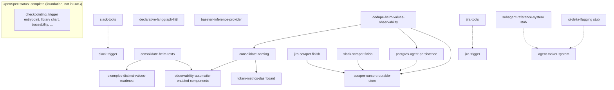

# OpenSpec implementation order (DAG + linear checklist)

This document captures **dependency ordering** for OpenSpec **changes that are not yet complete** in `openspec list`, so implementers can reduce merge pain and double-breaking `values.yaml` / Grafana / `helm/tests/` churn.

**Sources:** proposal cross-references (`examples-distinct-values-readmes` → `consolidate-helm-tests`), shared artifact overlap (values schema, Grafana JSON, unittest paths), and product coupling (Slack trigger vs tools; scrapers vs cursor store). `.openspec.yaml` files do **not** declare edges; some links are **judgment calls**—see caveats.

**As of:** 2026-04-15.

---

## Legend

- **Solid edge** — explicit dependency in an OpenSpec proposal, or strong file-overlap if reordered.
- **Dashed edge** — soft coupling (parallelize with coordination).

---

## Mermaid DAG



---

## ASCII (same graph)

```
                    ┌──────────────────────────────────────┐
                    │  foundation (OpenSpec: complete)      │
                    │  LangGraph entry, checkpoints, etc.   │
                    └──────────────────┬───────────────────┘
                                       │
                                       ▼
              ┌────────────────────────────────────────────┐
              │  dedupe-helm-values-observability           │
              │  (values/schema/runtime key split)         │
              └─────────────┬──────────────┬─────────────────┘
                            │              │
              ┌─────────────▼───┐          │
              │ consolidate-   │          │
              │ naming         │          │
              └───────┬────────┘          │
                      │                   │
         ┌────────────┼───────────┐       │
         │            │           │       │
         ▼            ▼           │       ▼
    ┌─────────┐ ┌─────────┐     │  ┌─────────────────┐
    │ o11y-   │ │ token-  │     │  │ postgres-agent- │
    │ auto    │ │ metrics │     │  │ persistence     │
    │ enabled │ │dashboard│     │  └────────┬────────┘
    │ comps   │ └─────────┘     │           │
    └────┬────┘                   │           │ (optional / cleaner)
         │                        │           ▼
         │                        │  ┌─────────────────┐
         │                        └──│ scraper-cursors │
         │                           │ durable-store   │
         │                           └────────▲────────┘
         │                     ┌──────────────┴──────────────┐
         │                     │                           │
         │              ┌──────▼──────┐             ┌─────────▼─────┐
         │              │ jira-scraper│             │ slack-scraper│
         │              │ (finish)    │             │ (finish)     │
         │              └─────────────┘             └──────────────┘
         │
  ┌──────▼──────────────────────────┐
  │ consolidate-helm-tests          │
  └──────┬──────────────────────────┘
         │
         ├──────────────────► examples-distinct-values-readmes
         │
         └── (also feeds) ──► observability-automatic-enabled-components
```

---

## Ordering tiers (why)

| Tier | Changes | Rationale |
|------|---------|-----------|
| **1** | `dedupe-helm-values-observability` | Defines where **checkpoints**, **wandb**, and Kubernetes **observability** (ex-`o11y`) live; `postgres-agent-persistence` and `scraper-cursors-durable-store` prose assume chart DSN / values paths this change reshapes. |
| **2** | `consolidate-naming` | BREAKING pass on chart `name`, **`agent:`** values key (alias), image repo, Grafana filename / product tags; cleaner **after** value *semantics* are deduped. |
| **3** | `consolidate-helm-tests` | Moves helm-unittest suites to `helm/tests/`; **`examples-distinct-values-readmes` explicitly depends on this**; `observability-automatic-enabled-components` should target the post-move layout. |
| **4** | `examples-distinct-values-readmes`, `observability-automatic-enabled-components` | Example values layout + component-neutral scrape / Grafana behavior; coordinate **Grafana filenames** with tier 2. |
| **5** | `postgres-agent-persistence` | Durable checkpoints + first-party tables; chart env should match **tier 1** contract. |
| **6** | Finish `slack-scraper` / `jira-scraper` (remaining tasks) | Current watermark / cursor behavior; **`scraper-cursors-durable-store`** generalizes those jobs. |
| **7** | `scraper-cursors-durable-store` | DSN reuse + abstraction; after **dedupe** (paths), after **scrapers** code paths; smoother after **postgres** exists. |
| **Parallel / leaf** | `baseten-inference-provider`, `declarative-langgraph-hitl` | Mostly additive; still touches shared tree—rebase often or land after **tiers 1–2**. |
| **Slack path** | `slack-tools` → `slack-trigger` | Tools first so trigger-launched runs can respond immediately; ingress and tools still need coordinated keys/tests. |
| **Jira path** | `jira-tools` → `jira-trigger` | Same split/order as Slack: LLM-time REST tools first, then webhook ingress using disjoint trigger keys. |
| **Later / meta** | `agent-maker-system` | Defers **`subagent-reference-system`**, **`ci-delta-flagging`**; consumes existing checkpoint / trace mechanisms. |
| **Stubs** | `subagent-reference-system`, `ci-delta-flagging` | Not an implementation queue until tasks exist. |

---

## Single linear checklist

Use this as **one valid topological sort**. Re-run `openspec list --json` after merges; statuses move as work lands.

- [ ] **1.** `dedupe-helm-values-observability` — split `o11y` vs product integrations; move checkpoints / wandb / Slack feedback keys per proposal.
- [ ] **2.** `consolidate-naming` — chart `name`, `agent:` alias, image repo, Grafana rename (`dalc-overview` etc.).
- [ ] **3.** `consolidate-helm-tests` — centralize suites under `helm/tests/`; CI `helm unittest -f …`; traceability path updates.
- [ ] **4.** `examples-distinct-values-readmes` — one values file per demonstrated setup; README index; unittest `values:` per file (**after** step 3).
- [ ] **5.** `observability-automatic-enabled-components` — component-neutral `ServiceMonitor` / Grafana story; tests under post-move `helm/tests/`.
- [ ] **6.** `token-metrics-dashboard` — Prometheus token / cost metrics + Grafana; keep aligned with **step 2** dashboard paths and **step 5** o11y specs.
- [ ] **7.** `postgres-agent-persistence` — Postgres checkpointer + relational stores; values/env match **step 1**.
- [ ] **8.** `jira-scraper` — complete any remaining tasks (OpenSpec had 13/14 at time of writing).
- [ ] **9.** `slack-scraper` — complete any remaining tasks (same).
- [ ] **10.** `scraper-cursors-durable-store` — durable watermark/cursor backends; reuse DSN story from **steps 1, 7**; builds on **8–9** code paths.
- [ ] **11.** `baseten-inference-provider` — inference provider subtree + runtime client (additive).
- [ ] **12.** `declarative-langgraph-hitl` — declarative interrupt/resume model (additive; checkpointing already complete).
- [ ] **13.** `slack-tools` — LLM-time Slack Web API tools.
- [ ] **14.** `slack-trigger` — inbound Slack → trigger pipeline (coordinate with **13** for mention → run → reply).
- [ ] **15.** `jira-tools` — LLM-time Jira REST tools (search/read/comment/transition/create-update).
- [ ] **16.** `jira-trigger` — Jira webhook ingress → hosted trigger pipeline (coordinate with **15**).
- [ ] **17.** `agent-maker-system` — bot + prefix convention slices; after platform stable enough for templates.
- [ ] **18.** Stub follow-ups — `subagent-reference-system`, `ci-delta-flagging`.

---

## Caveats

1. **Open PRs** may reorder work: e.g. [`postgres-agent-persistence`](https://github.com/jfeldstein/declarative-agent-library-chart/pull/15), [`checkpointing-delivery-split`](https://github.com/jfeldstein/declarative-agent-library-chart/pull/14)—reconcile this checklist with branch reality before sequencing sprints.
2. **Tiers 1 vs 2** (`dedupe` vs `naming`) — both touch many of the same files; **dedupe → naming** minimizes re-breaking the same keys twice; reversing is possible with one coordinated merge.
3. **Steps 5–6** can swap if Grafana ownership is serialized differently; both share the “Grafana + o11y specs” lane—avoid parallel PRs without coordination.
4. **Steps 11–12** (and parts of **15**) are **independent** of scrapers; the linear list places them after persistence/scrapers for a “platform then features” narrative—valid parallel tracks exist after **step 2** or **3** with careful rebasing.

---

## Maintenance

When a change reaches **complete** in `openspec list` and is archived, remove or strike it from the checklist and refresh the DAG if new changes appear. Optionally link this doc from `ARCHITECTURE.md` or `AGENTS.md` if maintainers want it discoverable.

**Authoring source of truth:** normative requirements live under **`openspec/changes/<name>/`** (deltas while a change is active) and **`openspec/specs/*/spec.md`** once promoted. The former **`docs/implementation-specs/`** per-step handoffs were removed: that queue is implemented in-tree, and duplicating plans there was redundant with OpenSpec + this checklist.
